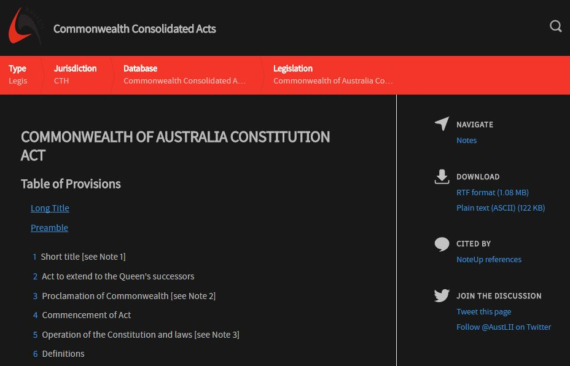

# AustLII Dark

- Makes [AustLII](http://www.austlii.edu.au/) dark

## Install
- Download a userstyle manager (eg. [Stylus](https://add0n.com/stylus.html))
- Visit the [AustLII Dark page on userstyles.org](https://userstyles.org/styles/149563/austlii-dark)
- Click 'Install Style'